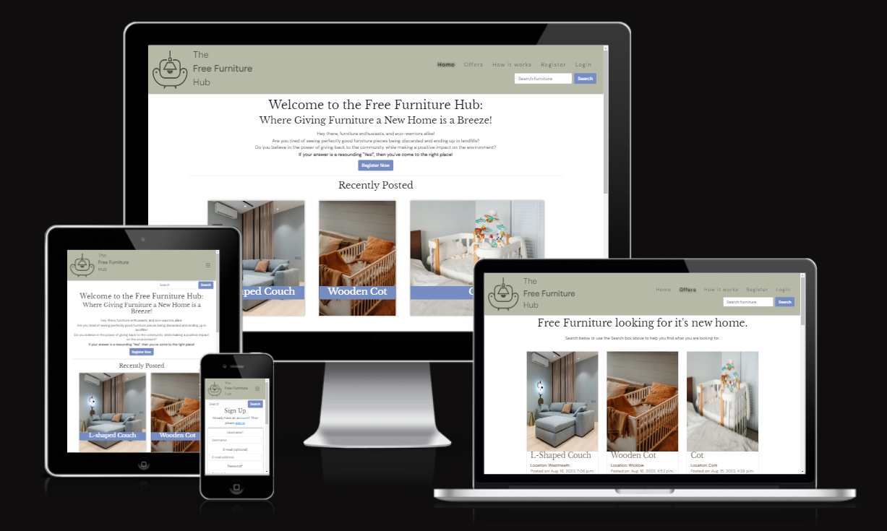
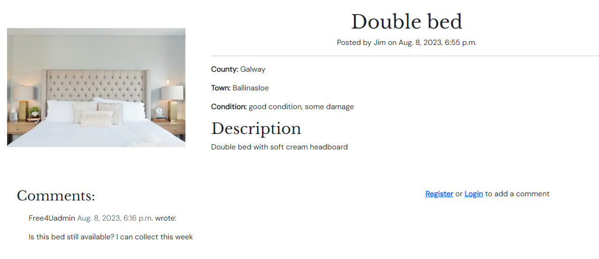

# The Free Furniture Hub

[View the live project here](https://free-furniture-hub-10db98e468e6.herokuapp.com/)

**The Free Furniture Hub** is a website that aims to reduce the amount of usable furniture that goes to landfill. It enables users to upload a photo of an item of furniture that they no longer want and would like to give away free of charge. Another user can then log in and comment on an item of furniture in order to arrange for that item to be collected.

## Index – Table of Contents
* [Planning](#planning) 
* [User Experience (UX)](#user-experience-ux) 
* [Features](#features)
* [Design](#design)
* [Technologies Used](#technologies-used)
* [Testing](#testing)
* [Deployment](#deployment)
* [Credits](#credits)

## Planning

- The ideal user is:

  - anyone who is interested in sourcing furniture items free of cost or anyone interested in posting an item of furniture to offer to avoid the item going to landfill and help someone else who needs it.
 
- Site goals:

  - To provide users with a platform to advertise items that want to offer free of charge
  - To provide users with a platform to source items free of charge
  - To reduce the amount of waste going to landfill
  - To encourage a sustainable mindset

- Model diagram

  - The below diagram visually represents how the database models are connected
    

    
Model Diagram

    
    

- Agile Kanban board
    - Link to Github Project board that User Storires were added and managed from [Free Furniture Agile Tool](https://github.com/users/Louibens/projects/4/views/1)
    - The User Stories have acceptance criteria, tasks and labels to show whether the requirement was Must Have, Could Have, Won't have.
    - 2 User Stories that were not implemented as part of this sprint have been added to a Next iteration column/channel and have been captured in the Future Features section below.

    

    
Kanban Board

    
    

    

    
EPIC/USER STORIES/TASKS

    
    

    

## User Experience (UX)

-   ### User stories

    -   #### Visitor Goals
        1. As an unregistered user, I want to be able to easily register on the website in order to get access to list items or comment on other users items
        2. As a registered user, I want to be able to easily sign in/out on the website in order to be able to list items or comment on items
        3. As a user, I want to be able to easily browse through the items that are available
        4. As a user, I want to be able to search the items to make it easier to find items I want
        5. As a registered user, I want to be able to comment on items so that I can arrange to collect from the item poster
        6. As a registered user, I want to be able to view the items that I have posted
        7. As a registered user, I want to be able to manage items that I have posted – update or delete
    
## Features

-   ### F01 LOGO and COMPANY NAME

    - The company logo incorporates furniture shapes to emphasise what the website is about.
    - The company name is positioned beside the logo using DM Sans
    - A user can click on the logo to bring them to the homepage
    - The logo was created on freelogodesign.org website. The chair shape was chosen as it ties in with the furniture theme. This is combined with the text logo at the top left of the website which users will naturally read first.

 -  ### F02 NAV BAR

    - The navigation menu links displayed will vary on whether a user is logged in and if they have posted items to the site.
    - When a user is logged in they will be able see their username beside the navigation links. 
    - If a user is not logged in they will be able to view all items and comments but will be unable to create a post or comment on posts.
    - If a user has not created any posts, they will not see the My Items page.
    - The nav bar will also display a link to the Admin panel if the admin user is logged in.

        - Not logged in

        - Logged in and has posted items

        - Logged in but has not posted items

    
        - Logged in as Admin

-   ### F03 SEARCH BOX

    - The search box is positioned in the nav bar for desktop users and moves below the nav bar for mobile users to ensure good visibility throughout site.
    - The search box enables users to search for specific items of furniture by location, room and keyword from description or title.

-   ### F04 RECENTLY POSTED

    - 3 recently posted items are displayed on the home page to give users an indication of what they can find on the site.
    - Users can click on them and view the specific items details.

-   ### F05 FOOTER

    - Links to 4 social networks to enable users to connect with us through our social channels

-   ### F06 CREATE ITEM PAGE

    - If a user is logged in they will be able to add a furniture item post using the form

   
-   ### F07 OFFERS PAGE

    - Full listing of all furniture items that have been posted (and not deleted) on separate cards. 
    - Each card displays an image of the item, title, location, posted date and snippet of the item description
    - The page will show 12 furniture items and the user can click the Next button to see the next 12

-   ### F08 DETAILS PAGE

    - User can see large image of item, posted date and which user posted it. 
    - County, location, condition and full description are displayed.
    - A user will not be able to see the Comment Form unless they sign in or register - appropriate links are provided

-   ### F09 COMMENTS

    - User can see comments that have been added by other uses but can only add a comment if they are logged in. The user will be asked to Register or Sign In to add a comment.
    - The comments section will be used by users to arrange to have the item of furniture collected or ask questions.

-   ### F10 MY ITEMS

    - If a user has posted items and is logged in, they will have a My Items page added that they can navigate to via a link in the nav bar
    - The user can easily update and delete items from here

-   ### F11 WELCOME MESSAGE

    - If a user is not logged in, the user will see a Register Now button as a Call To Action to register on the website. 
    - If the user is logged in, the Register Now button will not be displayed

-   ### F12 HOW IT WORKS PAGE

    - This page is for information for the user on how to use the site. It has been designed in line with the home page.

 

-   ### F13 EDIT FUNCTION

    - If a user is logged in and has created a furniture post, they can edit it by clicking the edit button on the specific item detail page
    - The user will see a success message once they have submitted the edit form

-   ### F14 DELETE FUNCTION

    - If a user is logged in and has created a furniture post, they can delete it by clicking the delete button on the specific item detail page. 
    - The user will be asked to verify if they are sure they want to delete and then will see a success message when the action is complete.

-   ### F15 AllAuth pages

    - In order for a user to be able create, read, edit and delete furniture posts as well as comment on items, they will need to register on the site and be signed.
    - The sign in, sign up and logout allauth pages have been styled using crispy forms
    - If the user registers or logs in, they will get a success message to confirm.

## Future Features

-   ### Filtering

    - A filter could be applied on the Offers page to apply several search criteria. Currently the user can only search for one term at a time so for example, they can't currently search for couches in Dublin.

-   ### Liking

    - A like feature would make the website more interactive for users and would give the furniture poster an indication of how popular their item of furniture is.

-   ### Direct Messaging

    - A direct messaging feature would improve the user experience when they are arranging to collect furniture items as a user may not want to have that conversation in the comments section which is publicly visible.

-   ### Notifications

    - It would be beneficial if the item poster was notified when someone comments on their item to ensure it is not missed and arrangements can be made to have the item collected.

-   ### Contact Us 

    - In order to receive feedback and hear from our users it would be good to have a Contact Us form

## Design

-   ### Wireframes
    - The wireframe diagrams show how the site was designed for desktop, mobile and table for the homepage, offers page, Create a post page, Furniture Detail page, How it Works page and My Items pages

    

    
Desktop Wireframes

    
    

    

    
Tablet Wireframes

    
    

    

    
Smartphone Wireframes

    
    

-   ### Title/Logo
    - The company logo incorporates furniture shapes to emphasise what the website is about. The company name is positioned to the right of the logo using DM Sans font from GoogleFonts. This was selected as an easy to read and accessible font.
    - The logo was created on freelogodesign.org website. 

-   ### Imagery

    - Images were sourced from pexels.com or photos have been taken personally to be added to the website

-   ### Colour

  - The below colour palette was chosen for a neutral and natural feel

## Technologies Used

### Languages Used

-   [HTML5](https://en.wikipedia.org/wiki/HTML5)
-   [CSS3](https://en.wikipedia.org/wiki/Cascading_Style_Sheets)
-   [Jquery](https://jquery.com/)
-   [Python](https://www.python.org/)

### Frameworks, Libraries & Programs Used

-   [Google Fonts:](https://fonts.google.com/) used for the Libre Baskerville and DM Sans fonts.
-   [Font Awesome:](https://fontawesome.com/) was used to add social network icons.
-   [Git:](https://git-scm.com/) was used for version control by utilising the Gitpod terminal to commit to Git and Push to GitHub.
-   [GitHub:](https://github.com/) is used as the respository for the project code after being pushed from Git. GitHub projects was use to set up a Kanban board to facilitate the Agile development standards.
-   [Balsamiq:](https://balsamiq.com/) was used to create the wireframes during the design process.
-   [Django](https://www.djangoproject.com/) was used as the framework 
-   [Bootstrap](https://getbootstrap.com/) was used to build responsive web pages
-   [Gunicorn](https://gunicorn.org/) was used as the Web Server to run Django on Heroku
-   [dj_database_url](https://pypi.org/project/dj-database-url/) library used to allow database urls to connect to the postgres db
-   [psycopg2](https://pypi.org/project/psycopg2/) database adapter used to support the connection to the postgres db
-   [Cloudinary](https://cloudinary.com/) used to store the images used by the application
-   [Django allauth](https://django-allauth.readthedocs.io/en/latest/index.html) used for account registration and authentication
-   [Django crispy forms](https://django-crispy-forms.readthedocs.io/en/latest/) used to simplify form rendering
-   [Django Pillow](https://pypi.org/project/Pillow/) to enable image processing capabilities

    
## Testing

### Manual Testing Test Cases and Results

- The below table details the test cases that were used and the results and relates back to the website Features
- There is also a "FAILED tests now fixed" section outlining the tests that failed, how they were fixed and the relevant commit reference
- Click the table to enlarge for better readability

    

    
Manual Testing Table

    
    

 ### Automated Validator Testing

 #### HTML Validation

 - W3C Validator flagged an issue with an 'a' element surrounding a 'button' element. Removed button element and just use anchor tag for the Register Now button

    - Results for homepage
      - 

        
Home Page

        
      

    - Results for Offers
      - 

        
Offers Page

        
      

    - Results for How It Works
      - 

        
How It Works Page

        
      

    - Results for Detail page
      - 

        
Detail Page

        
      

    - Results for My Items page
      - 

        
My Items Page

        
      

 #### CSS Validation

 - No issues flagged during CSS validation

    - Results for base.css
      - 

        
base.css

        
      

 #### JS Validation

 - No issues flagged during JS validation

  

    
JS HINT

  
  

 #### Python Validation

 - No issues flagged during Python validation

  

    
Project settings.py

  
  

  

    
Project urls.py

  
  

  

  
Home app urls.py

  
  

  

  
Home app views.py

  
  

  

  
Furniture app views.py

  
  

  

  
Furniture app urls.py

  
  

  

  
Furniture app models.py

  
  

  

  
Furniture app forms.py

  
  

  

  
Furniture app admin.py

  
  

 #### Lighthouse
 
 - I used Lighthouse within the Chrome Developer Tools to allow me to test the performance, accessibility, best practices and SEO of the website.

    - Desktop

  - Mobile

 ### Additional Testing Comments

- Testing has been carried out on the following browsers :

    - Chrome Version 115.0.5790.173 (Official Build) (64-bit)
    - Firefox Version 116.0.2 (64-bit)
    - Edge Version 115.0.1901.203 (Official build) (64-bit)

- Testing has also been carried out on desktop, laptop and smartphone for a variety of screen sizes.

## Deployment

Detailed below are instructions on how to clone and fork this project repository and the steps to configure and deploy the application.  

1. How to Clone the Repository
2. How to Fork the Repository
3. Create Application and Postgres DB on Heroku
4. Configure Cloudinary to host images used by the application
5. Connect the Heroku app to the GitHub repository
6. Executing automated tests
7. Final Deployment steps

### How to Clone the Repository 

- Go to the https://github.com/Louibens/PP4_FreeFurnitureHub repository on GitHub 
- Click the "Code" button to the right of the screen, click HTTPs and copy the link there
- Open a GitBash terminal and navigate to the directory where you want to locate the clone
- On the command line, type "git clone" then paste in the copied url and press the Enter key to begin the clone process
- To install the packages required by the application use the command : pip install -r requirements.txt
- When developing and running the application locally set DEBUG=True in the settings.py file
- Changes made to the local clone can be pushed back to the repository using the following commands :

  - git add *filenames*  (or "." to add all changed files)
  - git commit -m *"text message describing changes"*
  - git push

- N.B. Any changes pushed to the master branch will take effect on the live project once the application is re-deployed from Heroku

### How to fork the repository

- Go to the https://github.com/Louibens/PP4_FreeFurnitureHub repository on GitHub 
- Click the "Fork" button in the top right corner

### Create Application and Postgres DB on Heroku
- Log in to Heroku at https://heroku.com - create an account if needed.
- From the Heroku dashboard, click the Create new app button.  
- On the Create New App page, enter a unique name for the application and select region.  Then click Create app.
- On the Application Configuration page for the new app, click on Settings on the Application Configuration page and click on the "Reveal Config Vars" button - add the following
- DISABLE_COLLECTSTATIC and assign it a value of 1.
- SECRET_KEY and assign it a value - any random string of letters, digits and symbols.
- PORT = 8000
- CLOUDINARY_URL = url from cloudinary account
- The settings.py file should be updated to use the DATABASE_URL, CLOUDINARY_URL and SECRET_KEY environment variable values as follows :

  - DATABASES = {'default': dj_database_url.parse(os.environ.get('DATABASE_URL'))}
  - SECRET_KEY = os.environ.get('SECRET_KEY')
  - CLOUDINARY_URL = os.environ.get('CLOUDINARY_URL')

- In Gitpod, in the project terminal window, to initialize the data model in the postgres database, run the command : python3 manage.py migrate 
- Make sure the project requirements.txt file is up to date with all necessary supporting files by entering the command : pip3 freeze --local > requirements.txt
- Commit and push any local changes to GitHub.
- In order to be able to run the application on localhost, add SECRECT_KEY, CLOUDINARY_URL and DATABASE_URL and their values to env.py

### Configure Cloudinary to host images used by the application
- Log in to Cloudinary - create an account if needed.  To create the account provide your name, email and set up a password.  For "primary interest" you can choose "Programmable Media for image and video API".  Click "Create Account" and you will be sent an email to verify your account and bring you to the dashboard.
- From the dashboard, copy the "API Environment variable" value by clicking on the "Copy to clipboard" link.
- Log in to Heroku and go to the Application Configuration page for the application.  Click on Settings and click on the "Reveal Config Vars" button.
- Add a new Config Var called CLOUDINARY_URL and assign it the value copied from the Cloudinary dashboard, but remove the "CLOUDINARY_URL=" at the beginning of the string. 
- In order to be able to run the application on localhost, also add the CLOUDINARY_URL environment variable and value to env.py

### Connect the Heroku app to the GitHub repository
- Go to the Application Configuration page for the application on Heroku and click on the Deploy tab.
- Select GitHub as the Deployment Method and if prompted, confirm that you want to connect to GitHub. Enter the name of the github repository (the one used for this project is (https://free-furniture-hub-10db98e468e6.herokuapp.com/) and click on Connect to link up the Heroku app to the GitHub repository code.
- Scroll down the page and choose to either Automatically Deploy each time changes are pushed to GitHub, or Manually deploy - for this project Manual Deploy was selected.
- The application can be run from the Application Configuration page by clicking on the Open App button.
- The live link for this project is (https://free-furniture-hub-10db98e468e6.herokuapp.com/)

### Final Deployment steps
Once code changes have been completed and tested on localhost, the application can be prepared for Heroku deployment as follows :
- Set DEBUG flag to False in settings.py
- Ensure this line exists in settings.py to make summernote work on the deployed environment (CORS security feature): X_FRAME_OPTIONS = 'SAMEORIGIN'
- Ensure requirements.txt is up to date using the command : pip3 freeze --local > requirements.txt
- Push files to GitHub
- In the Heroku Config Vars for the application delete this environment variable :  DISABLE_COLLECTSTATIC
- On the Heroku dashboard go to the Deploy tab for the application and click on deploy branch

#### The live link to the application can be found here - [The Free Furniture Hub](https://free-furniture-hub-10db98e468e6.herokuapp.com/) 

## Credits

### Code research

 - Researched how to add the Delete success message as the transition page to confirm user wants to delete was causing an issue - Solution found on stackoverflow - [stackoverflow](https://stackoverflow.com/questions/47636968/django-messages-for-a-successfully-delete-add-or-edit-item)
 - The Recipe Sharing website tutorial helped me to code a lot of the Free Furniture Hub - [Recipe Tutorial](https://www.youtube.com/playlist?list=PLXuTq6OsqZjbCSfiLNb2f1FOs8viArjWy)
 - The django messages were researched here - [Messages Framework](https://docs.djangoproject.com/en/4.2/ref/contrib/messages/)
 - Add placeholder text on form field was researched on Stackoverflow - [stackoverflow](https://stackoverflow.com/questions/44133562/django-add-placeholder-text-to-form-field)
 - Resolved some images being skewed on the Offers page following research on Stackoverflow - [stackoverflow](https://stackoverflow.com/questions/10830735/center-image-in-div-with-overflow-hidden)

### Acknowledgements

- Thanks goes to my family who have given me the time and space to learn a lot during the building of this project. I am proud of what I have achieved thanks to their patience and understanding.
- My mentor, Elaine Roche, has been great as always, guiding and inspiring me throughout the epic journey. 
- I also reached out on the Peer Review Slack Channel and got some good feedback, some of which I implemented, so thanks to the Code Institute for providing a great network of great people including Allen Gleeson who replied with his feedback.
- I used Tutor Support a few times during this project and would like to thank them for their patience and support when I was having my low moments trying to get things working.